<p align="center">
  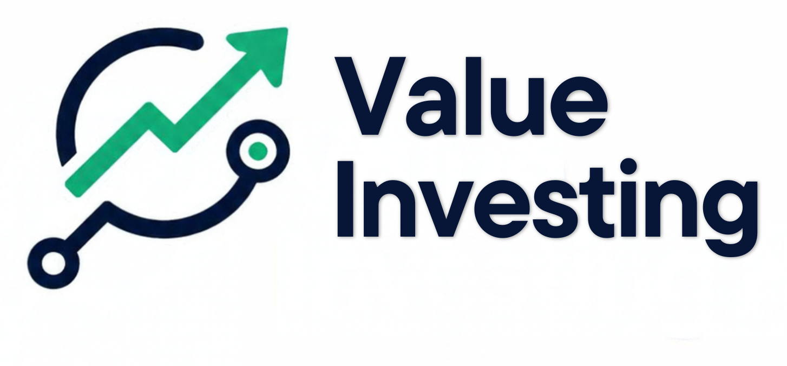
</p>

<h1 align="center">Value Investing</h1>

<p align="center">
  <em>Terminal-first fundamental analysis with eight independent book frameworks,
  transparent DCF valuation, and SEC filing data.</em>
</p>

<p align="center">
  <a href="https://github.com/JdeJusto/Value_Investing/releases"></a>
  <a href="https://github.com/JdeJusto/Value_Investing/actions/workflows/ci.yml"></a>
  <a href="tests/unit"></a>
  <a href="LICENSE"></a>
  
  
  
  
</p>

<p align="center"><a href="README.md">English</a> · <a href="README.es.md">Español</a></p>

> **What makes this different**
>
> Most tools give you one score. This one runs **eight book methodologies in
> parallel** and shows where they agree and disagree. Disagreement is
> information, not a bug.

Value Investing runs eight independent investment frameworks against the same financial facts. It shows what each method concludes, where they disagree, and the rules behind those conclusions. Use the offline demo to explore the interface, or connect the companion Financial-DataBase for SEC-derived fundamentals.

## Table of contents

- [Screenshots](#screenshots)
- [Workflows](#workflows)
- [Features](#features)
- [The 8 methodologies](#the-8-methodologies)
- [DCF valuation](#dcf-valuation)
- [Quick start](#quick-start-30-seconds)
- [Installation](#installation)
- [Usage](#usage)
- [Data engine](#data-engine)
- [Architecture](#architecture)
- [Roadmap](#roadmap)
- [FAQ](#faq)
- [Tests](#tests)
- [Contributing](#contributing)
- [Contributors](#contributors)
- [License](#license)
- [Star History](#star-history)
- [Acknowledgments](#acknowledgments)

<a id="screenshots"></a>
## Screenshots

Captured at a 1600 × 1000 browser viewport. The demo screenshots use pinned data; the screener screenshot uses the live local Financial-DataBase and a Yahoo price snapshot.

### Home — portfolio snapshot, opportunities, and alerts

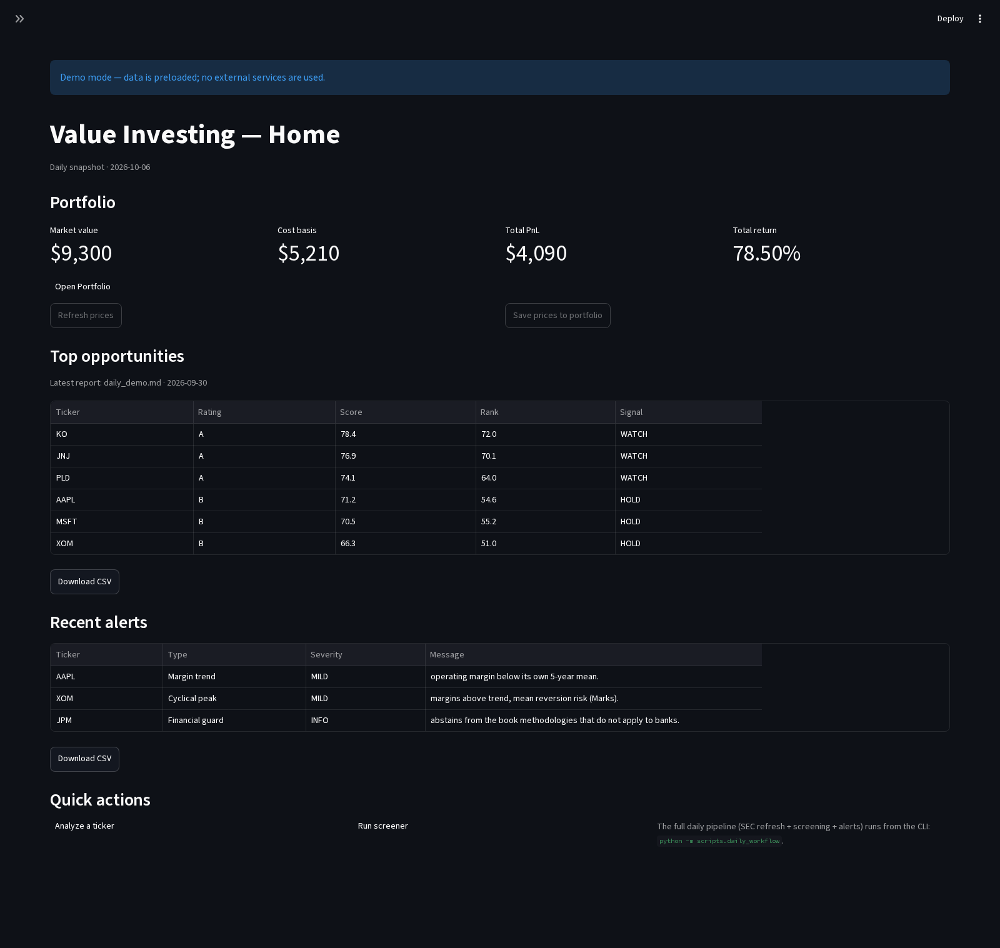

### Analysis — eight methodology verdicts

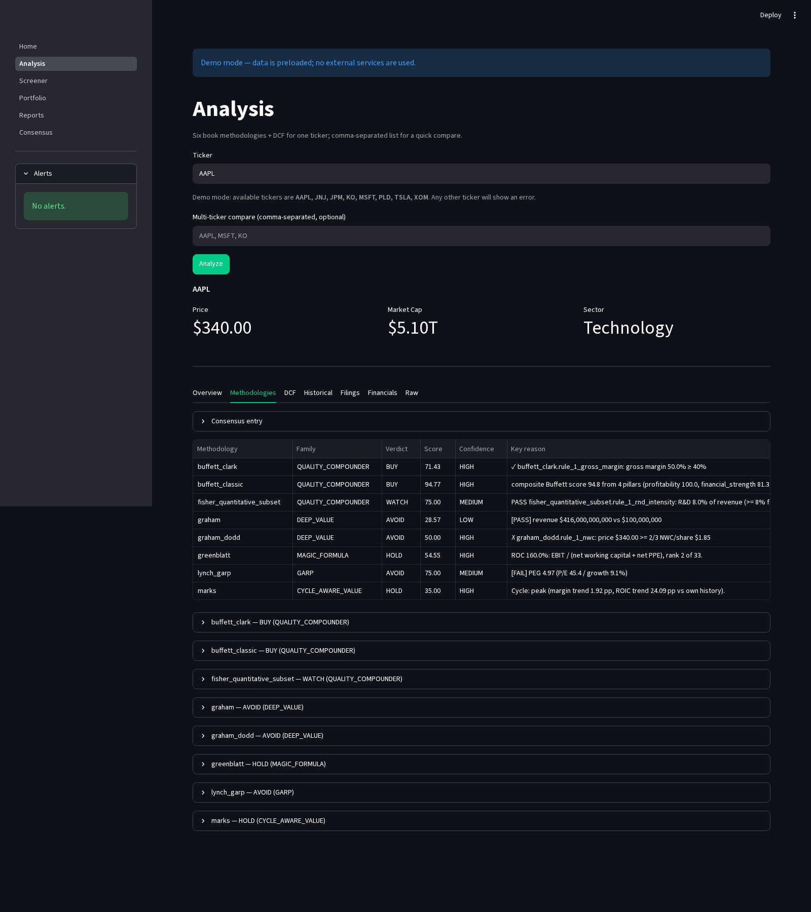

### Analysis — the disagreement summary

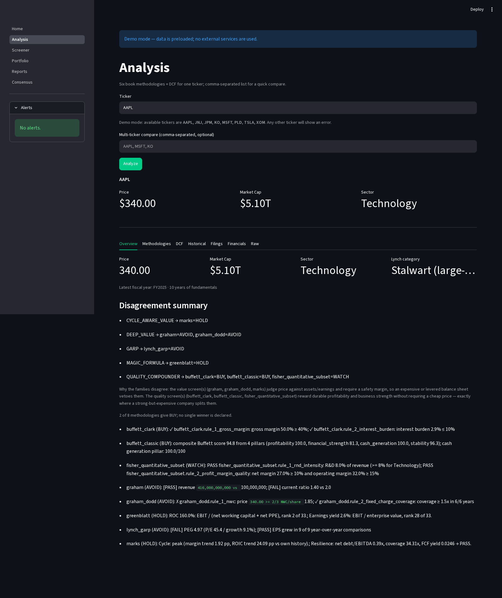

The frameworks evaluate the same fundamentals independently. The disagreement summary explains why their verdicts differ instead of hiding the conflict in one composite score.

### DCF — intrinsic value and sensitivity

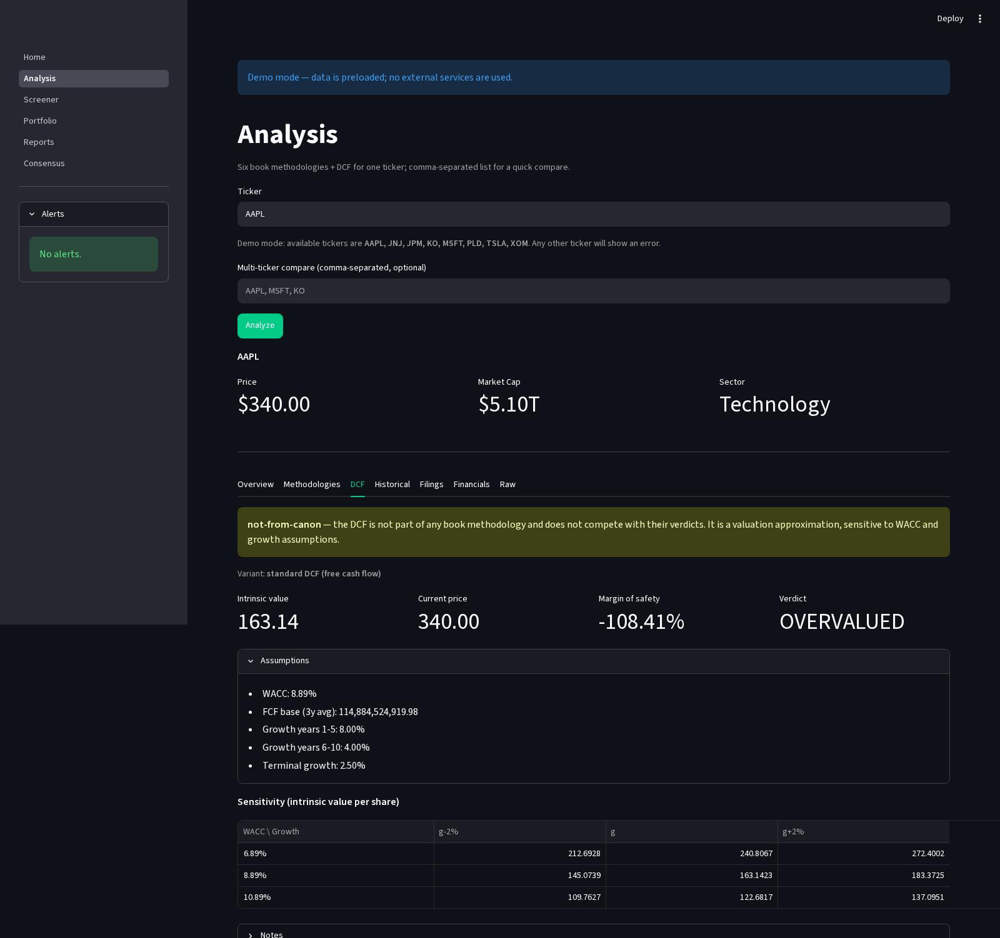

The DCF is labeled `not-from-canon`: it is a practical valuation, not a book rule, and never feeds methodology scores.

### Financials — insights and statement facts

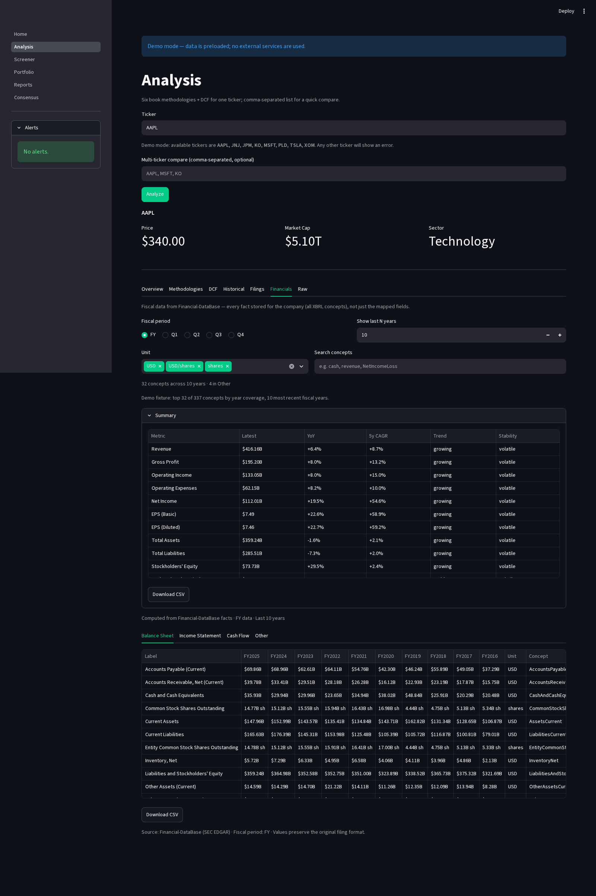

See the [financial display conventions](docs/number_formatting.md) and the [Financials view architecture](docs/architecture.md#financials-view).

### Filings — SEC source documents

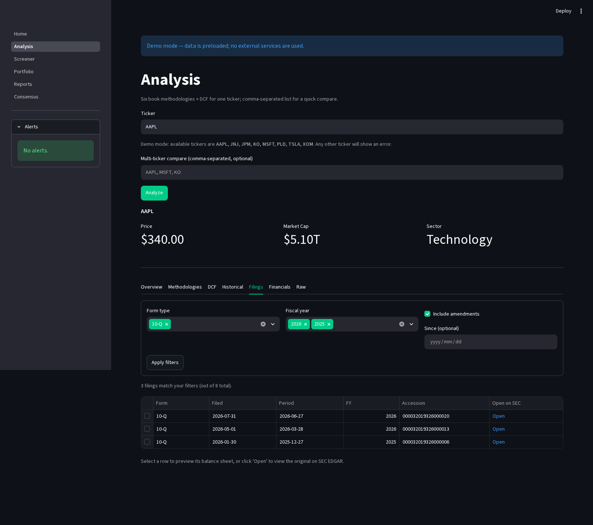

Select a filing in the app to load its statement preview; this capture shows the populated filings list and source links.

See the [filing extraction status](docs/filings_extraction.md) and [narrative extraction notes](docs/narrative_extraction.md).

### Consensus — agreement across the universe

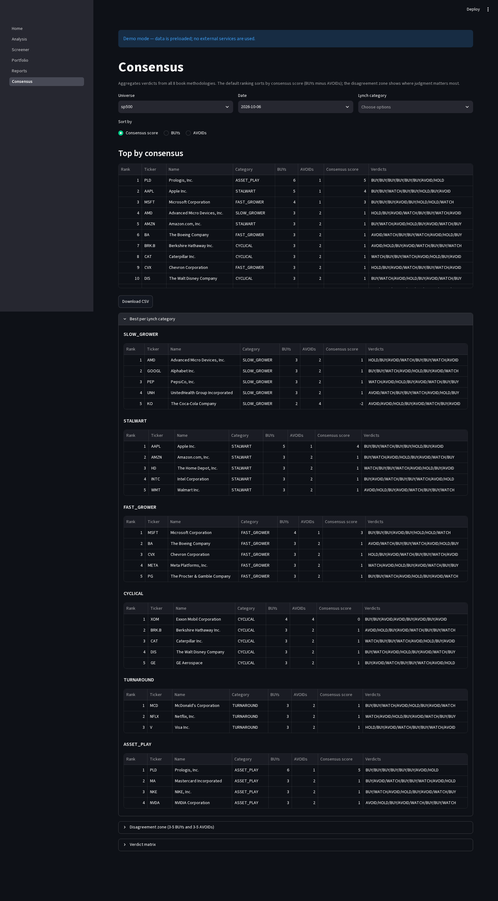

This is the offline demo snapshot: eight pinned demo tickers plus synthetic sample rows to demonstrate the ranking layout.

See the [consensus screener design](docs/consensus_screener.md).

### Screener — Technology companies with WATCH verdicts

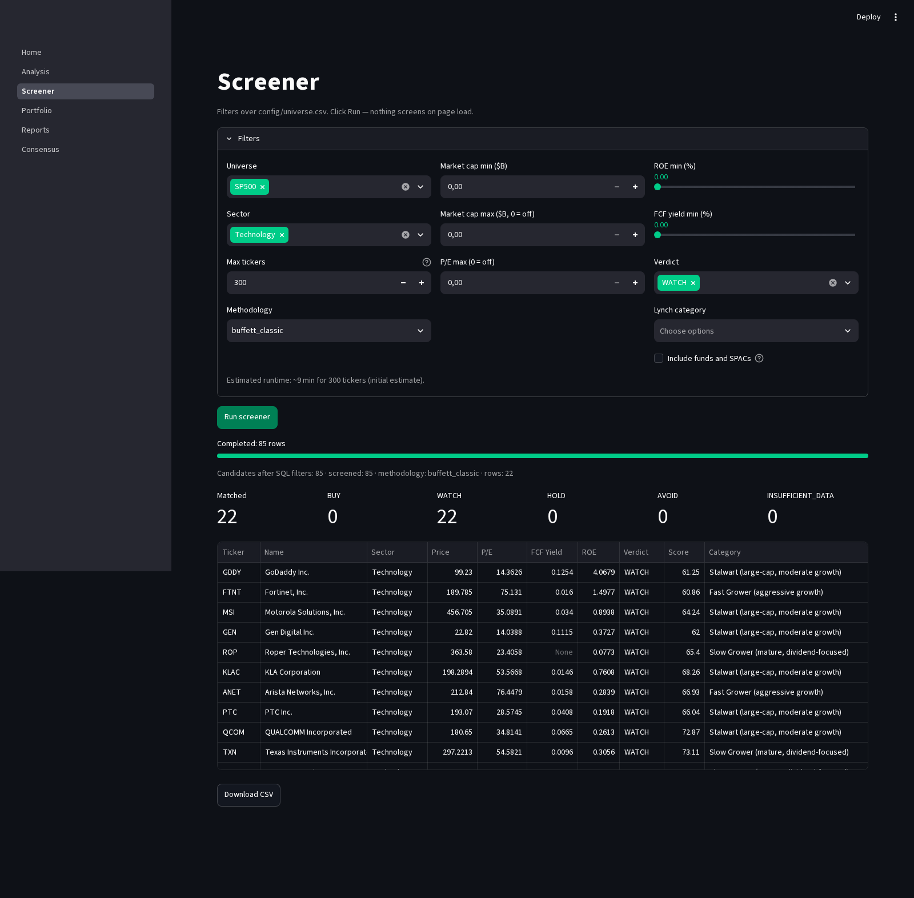

The live run filtered 85 Technology candidates to 22 WATCH verdicts.

### CLI — `analyze-full AAPL --demo`

Excerpt from the actual CLI output (ANSI color codes removed):

```text
Comprehensive analysis: AAPL
1) Company overview
     Ticker         AAPL
     Name           Apple Inc.

2) Real-time price and valuation
     Price              $340.00
     Market Cap         $4856.5B
     PER                43.2
     P/B                85.20
     FCF Yield          2.6%
     EV/EBIT            36.7

3) Fundamental metrics
     ROE                      197.1%
     ROIC                     89.1%
     Operating margin         32.0%
     Net margin               27.0%
     Revenue growth           8.0%
     Debt / Equity            1.70
     Free Cash Flow           $125.2B

4) Company quality
     Buffett score        94.8
     Moat                 STRONG
     Rating               A
     Confidence           HIGH
     Total score          96.1

DCF Valuation (supplementary, not-from-canon)
         Intrinsic value/share : $163.14
                 Current price : $340.00
              Margin of safety : -108.4%
                       Verdict : OVERVALUED
```

<a id="workflows"></a>
## Workflows

**Browse the platform**


**Portfolio workflow from the terminal**

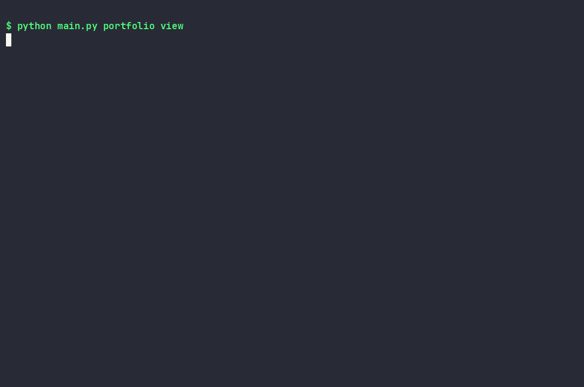

**Financial statements with insights**


**Consensus across categories and disagreement**


<a id="features"></a>
## Features

- **Eight methodologies, side by side.** Each framework evaluates the same company independently.
- **Disagreement as a feature.** See the rules and reasons behind different conclusions instead of relying on one averaged score.
- **Financial guards.** Methodologies abstain from company types their assumptions do not fit, including banks and insurers.
- **Comprehensive financials.** Browse SEC XBRL facts by statement and fiscal year, including concepts not mapped to analysis fields.
- **Automatic insights.** Review growth, YoY changes, CAGR, trend, stability, and direction changes from the same facts as the tables.
- **Deterministic alerts.** Cash runway, margin, debt, FCF, revenue, earnings-quality, and dividend signals include their evidence.
- **Source documents.** Browse SEC filings and extract statements, Risk Factors, and MD&A.
- **Consensus screener.** Rank companies across all eight verdicts, compare Lynch categories, and inspect the disagreement zone.
- **Deterministic analysis.** No LLM is used for rules, verdicts, insights, or alerts.
- **Prices are never written to a database.** Yahoo quotes are fetched on demand and cached in memory; consensus snapshots are report artifacts.

See [financial alert rules](docs/financial_alerts.md), [data-gap findings](docs/data_gaps_investigation.md), and the [concept coverage audit](docs/concept_coverage_audit.md).

<a id="the-8-methodologies"></a>
## The 8 methodologies

| Methodology | Source | Family | What it looks for |
|---|---|---|---|
| `graham` | *The Intelligent Investor* (1949) | `DEEP_VALUE` | Defensive criteria, financial strength, and the 22.5 valuation test |
| `graham_dodd` | *Security Analysis* (1934) | `DEEP_VALUE` | Net working capital, earnings stability, and fixed-charge coverage |
| `buffett_classic` | Internal four-pillar framework | `QUALITY_COMPOUNDER` | Profitability, financial strength, cash generation, and stability |
| `buffett_clark` | *Warren Buffett and the Interpretation of Financial Statements* | `QUALITY_COMPOUNDER` | Durable margins, interest burden, and owner-earnings signals |
| `fisher_quantitative_subset` | *Common Stocks and Uncommon Profits* (1958) | `QUALITY_COMPOUNDER` | Quantitative subset: R&D intensity, margins, and dilution |
| `lynch_garp` | *One Up on Wall Street* (1989) | `GARP` | PEG, earnings growth, and Lynch company categories |
| `marks` | *The Most Important Thing* (2011) | `CYCLE_AWARE_VALUE` | Cycle position, resilience, leverage, and margin of safety |
| `greenblatt` | *The Little Book That Beats the Market* (2005) | `MAGIC_FORMULA` | Return on capital and earnings yield ranking |

See the [methodology decisions](docs/methodology_decisions.md), [scoring methodology](docs/scoring_methodology.md), and [scoring validation](docs/scoring_validation.md).

<a id="dcf-valuation"></a>
## DCF valuation

The DCF is a supplementary valuation labeled **`not-from-canon`**. It lives outside the methodology registry and never changes a book-derived verdict or composite score. Five evaluation routes cover standard FCF, REIT FFO, two-stage and single-stage financial DDM, and hyper-growth companies. Missing or unsuitable inputs produce `INSUFFICIENT_DATA` rather than fabricated values.

See [the DCF design notes](backend/valuation/README.md) for assumptions, formulas, and variant behavior.

<a id="quick-start-30-seconds"></a>
## Quick start (30 seconds)

Try the pinned offline bundle without PostgreSQL, SEC access, or Yahoo:


```bash
git clone https://github.com/JdeJusto/Value_Investing.git
cd Value_Investing
python -m pip install pipenv
PIPENV_VENV_IN_PROJECT=1 pipenv install --dev

python main.py analyze-full AAPL --demo
python main.py compare-methodologies AAPL --demo
VI_DEMO=1 ./run_ui.sh   # http://localhost:8501
```

Demo mode contains eight pinned tickers: AAPL, MSFT, KO, JNJ, JPM, XOM, PLD, and TSLA. It uses no external services.

<a id="installation"></a>
## Installation

Requirements: Python 3.13+ and Pipenv. A reachable Financial-DataBase PostgreSQL instance is recommended for the full SEC-derived data set. Local JSON fallback paths and the offline demo are available without it.

```bash
python -m pip install pipenv
PIPENV_VENV_IN_PROJECT=1 pipenv install --dev
cp .env.example .env
source .venv/bin/activate
```

Before SEC requests, set `SEC_USER_AGENT` to a descriptive application name and real contact address. Set `SEC_EMAIL` and `SEC_NAME` for the direct `edgartools` provider. Do not commit `.env` or credentials. See [`.env.example`](.env.example) for all settings.

<a id="usage"></a>
## Usage

### CLI

```bash
./vi analyze-full AAPL
./vi compare-methodologies AAPL
./vi consensus AAPL
./vi consensus-ranking --universe sp500 --top 20
./vi consensus-by-category --universe sp500 --per-category 5
./vi financial-alerts AAPL
./vi screener --tickers AAPL,MSFT
```

Output is rendered with [Rich](https://github.com/Textualize/rich): bordered panels and framed tables on a terminal, plus spinners and progress bars for long runs. Redirected output never contains color codes; `NO_COLOR=1` or the `--no-color` flag turns color off on a terminal as well.

Prefer a menu over flags: `./vi interactive` lists the main commands, asks for each one's arguments, and runs it in-process. Press `q` or Ctrl+C to leave.

```bash
./vi interactive
```

Consensus commands read the latest precomputed report. Refresh it with:

```bash
python -m scripts.compute_consensus_rankings --universe sp500
```

For the full workflow, see the [daily runbook](docs/runbook_daily.md).

### Streamlit UI

```bash
./run_ui.sh
```

The six pages are Home, Analysis, Screener, Portfolio, Reports, and Consensus. For a database-free walkthrough, use `VI_DEMO=1 ./run_ui.sh`.

### Filings and statements

```bash
python main.py filings AAPL --form 10-K,10-Q --year 2025
python main.py filing-statement AAPL --type balance_sheet
python main.py filing-statement AAPL --type income_statement
python main.py filing-statement AAPL --type cash_flow
python main.py filing-section AAPL --type risk_factors --word-limit 500
```

The Filings tab links to SEC source documents and can load statement or narrative previews. Parsed documents are cached locally under `data/raw/filings/`.

See [filing extraction](docs/filings_extraction.md) and [narrative extraction](docs/narrative_extraction.md).

### Portfolio and daily workflow

```bash
./vi portfolio view
./vi portfolio performance
./vi portfolio add AAPL 10 180.00 --thesis "moat"
python -m scripts.daily_workflow --dry-run --limit 5 --top 3
```

See the [daily runbook](docs/runbook_daily.md) for refresh, resume, and reporting options.

<a id="data-engine"></a>
## Data engine

The app can read SEC-derived fundamentals from the companion [Financial-DataBase](https://github.com/JdeJusto/Financial-DataBase) PostgreSQL project. Value Investing treats it as a read-only source; targeted refreshes are delegated to its CLI when configured. Local JSON storage is a fallback. Yahoo Finance provides on-demand prices, which are cached in memory and never written to a database. Consensus price snapshots are report files, not a database price store.

See [data sources](docs/data-sources.md), the [data-gap investigation](docs/data_gaps_investigation.md), and the [validation methodology](docs/validation_methodology.md). Browse the full [documentation index](docs/README.md).

<a id="architecture"></a>
## Architecture

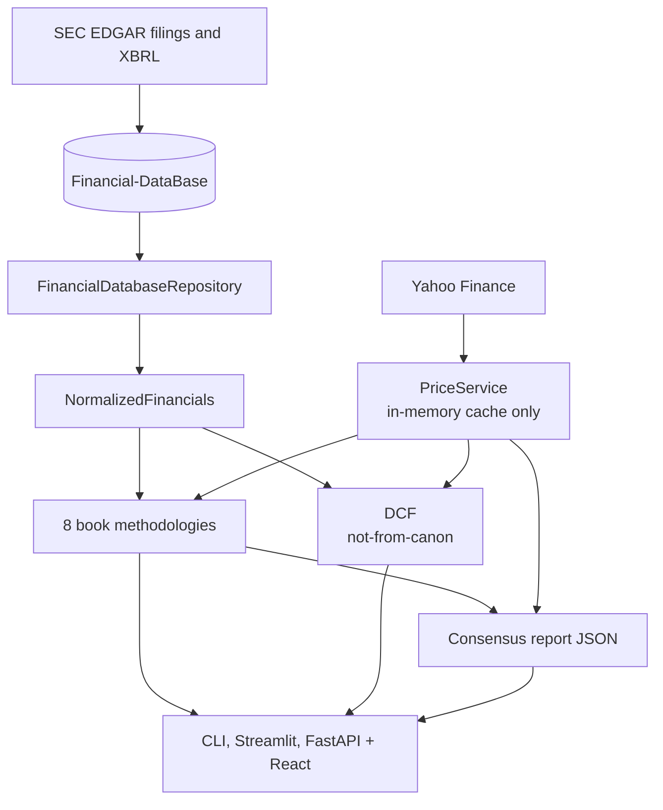

The domain uses plain Python objects; providers and repositories live at the edges. Each methodology receives the same normalized fundamentals and price interface. The DCF remains separate from book verdicts. More detail: [architecture](docs/architecture.md) and [consensus design](docs/consensus_screener.md).

Additional reviews: [full platform audit](docs/full_platform_audit_2026-09-24.md) and [refactor audit](docs/refactor_audit.md).

<a id="roadmap"></a>
## Roadmap

- [x] Eight independent book methodologies and separate DCF variants
- [x] Financial statements, insights, deterministic alerts, and filing previews
- [x] Consensus rankings, price snapshots, and disagreement-zone view
- [ ] Weekly automation for consensus and Greenblatt rankings
- [ ] Real-time alert notifications
- [ ] Broader documented methodology coverage
- [ ] REST API for mobile access — see [#27](https://github.com/JdeJusto/Value_Investing/issues/27) ([design](docs/api_design.md))

See the [engineering backlog](docs/backlog.md) for follow-up items.

## Mobile app (work in progress)

A native Android app that consumes the FastAPI backend. The Home screen
renders live company data, and the company detail screen ships four real
tabs: **Methodologies** (8 book verdicts), **DCF** (intrinsic value, margin
of safety, sensitivity), **Financials** (insights + year tables) and
**Filings** (statements + narrative sections). See
[`mobile/README.md`](mobile/README.md). Requires the API server running
locally (see `docs/api_design.md`).

<a id="faq"></a>
## FAQ

**Why eight methodologies instead of one composite score?**

A composite can hide disagreement. Independent frameworks answer different questions; the UI shows their verdicts and reasons side by side.

**Why is the DCF labeled `not-from-canon`?**

The book methodologies do not prescribe this DCF. It is a practical valuation model, kept separate so it cannot silently affect book-derived scores.

**Are market prices stored?**

Prices are never written to a database. Quotes are fetched on demand and cached in memory. Consensus JSON reports may contain a price snapshot for reproducibility.

**Can I analyze banks and insurers?**

Book rules abstain where their assumptions do not fit financial companies. The Financials tab still shows stored facts, and the DCF has dividend-discount variants for financials.

**Do I need Financial-DataBase?**

It is the recommended source for full SEC fundamentals. Local JSON fallback paths and the offline demo are available for exploration.

**Does the project use an LLM?**

No. Analysis rules, verdicts, insights, and alerts are deterministic.

<a id="tests"></a>
## Tests

```bash
python -m pytest tests/unit -q
ruff check .
ruff format --check .
```

The test-count badge is refreshed by the release script. Coverage is not currently measured, so there is no coverage badge.

<a id="contributing"></a>
## Contributing

Issues and pull requests are welcome. See [CONTRIBUTING.md](CONTRIBUTING.md), the [Code of Conduct](CODE_OF_CONDUCT.md), and [Security](SECURITY.md). The UI, CLI, and documentation are in English.

<a id="contributors"></a>
## Contributors

See the [GitHub contributors graph](https://github.com/JdeJusto/Value_Investing/graphs/contributors). Contributions are welcome.

<a id="license"></a>
## License

[MIT](LICENSE). The license applies to this repository's code, not to data supplied by external providers.

<a id="star-history"></a>
## Star History

[](https://star-history.com/#JdeJusto/Value_Investing&Date)

<a id="acknowledgments"></a>
## Acknowledgments

- The authors whose books inform the documented investment rules.
- The [SEC EDGAR](https://www.sec.gov/edgar) team for public filings and company facts.
- [Financial-DataBase](https://github.com/JdeJusto/Financial-DataBase) for the companion SEC-derived data engine.
- [Streamlit](https://streamlit.io/) for the UI and [yfinance](https://github.com/ranaroussi/yfinance) for on-demand market data.
