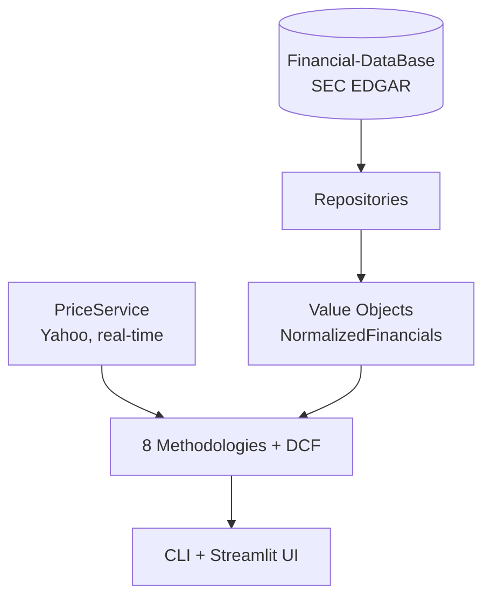

# Architecture

## 1. Overview

Value Investing is a terminal-first fundamental analysis platform. It reads
fundamentals from Financial-DataBase (SEC EDGAR), fetches prices in real
time, runs **eight book methodologies plus a DCF side-by-side**, and presents
the results through a CLI and a Streamlit UI. Nothing is a black box: every
verdict lists the rules it passed or failed, and every rule cites the book it
came from.

## 2. Layers



- **Domain** (`backend/domain/`): entities and value objects. No pandas, no
  network, no database — pure data. `NormalizedFinancials` is the canonical
  per-fiscal-year record every consumer reads.
- **Repositories** (`backend/repositories/`): data access.
  `FinancialDatabaseRepository` reads Financial-DataBase; the SQL and JSON
  repositories are fallbacks (and the JSON one powers demo mode).
- **Services** (`backend/services/`): orchestration. `PriceService` (prices,
  in-memory only), `RefreshService` (targeted SEC sync), `ui_adapter` (the
  shared view-model layer), `analysis_cache`, `screener_filters`.
- **Methodologies** (`backend/methodologies/`): one subpackage per book. Each
  implements the `Methodology` ABC and registers itself through a
  `METHODOLOGY` constant.
- **Analytics** (`backend/analytics/`): ratio computation and scoring.
- **UI** (`cli/` and `ui/`): presentation only — no business logic. The CLI
  commands and the Streamlit pages both read from `ui_adapter`/services.

## 3. Data flow

```text
python main.py analyze-full AAPL
    → ticker_resolver validates AAPL against Financial-DataBase
    → refresh_service checks freshness (targeted SEC sync if stale)
    → FinancialDatabaseRepository fetches the fiscal years
    → NormalizedFinancials value objects are built
    → the 8 methodologies evaluate the same rows
    → the DCF runs separately (labeled not-from-canon)
    → results are merged into the report
```

**Prices are never persisted.** Every price comes from `PriceService` at
request time and lives in an in-memory cache (TTL, default 15 min). The
Financial-DataBase `prices` table is untouched by this project — that
invariant is enforced by tests and checked in every session.

## 4. The Methodology contract

From `backend/methodologies/base.py`:

```python
class Methodology(ABC):
    def evaluate(ticker, fundamentals, prices) -> MethodologyResult: ...
    def rules() -> list[Rule]: ...
    def metadata() -> dict: ...
```

- `evaluate` receives already-fetched fundamentals (year-desc
  `NormalizedFinancials`) and a price service; it never touches the network
  or the database itself, which keeps every methodology deterministic and
  unit-testable.
- `MethodologyResult` carries the verdict (`BUY`/`WATCH`/`HOLD`/`AVOID`/
  `INSUFFICIENT_DATA`), an optional 0-100 score, metrics, reasons, red flags,
  confidence, the book sources and the passed/failed rule ids.
- `rules()` returns the explicit `Rule` objects, each with a `SourceRef`
  (book, edition, year, page, era, and a "us_caution" note).
- The registry (`backend/methodologies/registry.py`) auto-discovers
  subpackages: importing the package registers the `METHODOLOGY` singleton.
  Adding a methodology requires no change to the engine.

## 5. Why 8 methodologies instead of one composite score

This is the core design decision:

- **Composite scores hide disagreement.** A single number cannot tell you
  that Graham hates the price while Buffett loves the business.
- **Different frameworks answer different questions.** Graham asks about
  assets and safety margin; Buffett/Clark about durable economics; Lynch
  about growth at a reasonable price; Greenblatt about relative rank;
  Marks about cycle and risk.
- **Disagreement IS the signal.** When the value screens and the quality
  screens split, that is information about the company — not a bug to
  average away.
- `compare-methodologies` shows all verdicts side-by-side and explains the
  conflict, and it **never declares a winner**.

Real output (`python main.py compare-methodologies AAPL --demo`):

```text
  methodology        verdict            score    confidence
  ------------------ ------------------ -------- ----------
  buffett_clark      BUY       71.4     HIGH
  buffett_classic    BUY       94.8     HIGH
  fisher_quantitative_subset WATCH     75.0     MEDIUM
  graham             AVOID     28.6     LOW
  graham_dodd        AVOID     50.0     HIGH
  greenblatt         HOLD               54.5     HIGH
  lynch_garp         AVOID     75.0     MEDIUM
  marks              HOLD               35.0     MEDIUM

  Disagreement summary
  CYCLE_AWARE_VALUE → marks=HOLD
  DEEP_VALUE → graham=AVOID, graham_dodd=AVOID
  GARP → lynch_garp=AVOID
  MAGIC_FORMULA → greenblatt=HOLD
  QUALITY_COMPOUNDER → buffett_clark=BUY, buffett_classic=BUY, fisher_quantitative_subset=WATCH

  Why the families disagree: the value screen(s) (graham, graham_dodd, marks)
  judge price against assets/earnings and require a safety margin, so an
  expensive or levered balance sheet vetoes them. The quality screen(s)
  (buffett_clark, buffett_classic, fisher_quantitative_subset) reward durable
  profitability and business strength without requiring a cheap price — exactly
  where a strong-but-expensive company splits them.
  2 of 8 methodologies give BUY; no single winner is declared.
```

## 6. Why DCF lives outside `backend/methodologies/`

- The 8 book methodologies are derived from **actual published rules**, each
  with a citation. The DCF is a practical addition, not from any book.
- It lives in `backend/valuation/` and is labeled **`not-from-canon`** in the
  code, the CLI, the UI and the report.
- It **never enters `compare-methodologies`** and never feeds a methodology
  score (a test asserts the registry can never discover it).
- Four variants: standard, REIT (FFO-style), financial (single and two-stage
  DDM) and hyper-growth; the dispatcher picks one from the company type and
  says which it used.

## 7. Design decisions log

| Decision | Rationale |
|----------|-----------|
| No composite score | Hides disagreement; the platform's goal is to show conflicts |
| DCF is `not-from-canon` | Book methodologies must come from books; DCF does not |
| Financial guards | Banks/insurers cannot be evaluated with industrial rules (leverage, EV/EBIT) |
| Lynch `SLOW_GROWER` hides the score | PEG does not apply; the verdict uses dividend stability instead |
| Fisher and Marks are "subsets" | Their full frameworks require scuttlebutt / market-cycle context |
| Prices are never persisted | Real-time integrity; the DB does not cache market data |
| Greenblatt rankings are precomputed | The methodology is cross-sectional; a weekly timer ranks the universe |
| Analysis cache with `ANALYSIS_VERSION` | Prevents serving stale rows after a VO/normalization change |
| `not-from-canon` label is visible everywhere | Users must never confuse DCF output with book rules |
| Net income convention is explicit | JPM's "available to common" figure differs from EDGAR's consolidated one; the CLI says which it used |
| Demo mode swaps the composition, not the logic | One decision point (`backend/app/cli.py`) keeps `if demo:` out of the codebase |

## 8. Extending the system

Add a **methodology**:

1. Create `backend/methodologies/<name>/` with `__init__.py`,
   `methodology.py`, `rules.py`, `README.md`.
2. Implement `Methodology` (see `marks/` for a compact example).
3. Set `METHODOLOGY = YourMethodology()` in `__init__.py` — the registry
   discovers it.
4. Add a CLI command (`cli/commands/analyze_<name>.py`) with
   `add_demo_argument`/`add_refresh_arguments` and register it in
   `cli/commands/methodologies.py`.
5. Add tests (rules, verdicts, guards, determinism).
6. Update the registry assertion in `tests/unit/test_dcf_integration.py`.

Add a **DCF variant**:

1. Add an `_evaluate_<variant>` method to `DCFValuation`.
2. Extend the company-type detection if the variant needs a new type.
3. Add tests with realistic fixtures.

## 9. Known limitations

- Fisher's full 15 points and Marks' qualitative framework are **subsets**;
  the missing parts require external sources (scuttlebutt, market context).
- Greenblatt rankings need the weekly systemd timer to stay fresh (stale
  after 14 days → INSUFFICIENT_DATA).
- Some companies lack a mapped revenue concept in XBRL (structural, not a
  bug; see `docs/unmapped_coverage.md`).
- Yahoo rate limits can degrade price-dependent metrics — degradation is
  graceful and visible (N/A, never a fabricated number).

## Filing extraction

Statements are parsed by `FinancialStatementParser`
(`backend/services/financial_statement_parser.py`) with three supported types:
`BALANCE_SHEET`, `INCOME_STATEMENT` and `CASH_FLOW` (per-type anchors and
required label pairs live in `STATEMENT_SIGNATURES`). The parser tries HTML
anchors first (legacy filings) and falls back to the largest table matching
the type's label pair — modern filings carry no anchors, so the fallback is
the working path. Parsed statements are cached as JSON next to the raw HTML
(`<doc>.<statement_type>.json`, versioned by `PARSER_VERSION`);
`backend/services/balance_sheet_parser.py` is a v0.6.0 compatibility shim.

## Narrative extraction

Risk Factors and MD&A are extracted as plain text by `NarrativeExtractor`
(`backend/services/narrative_extractor.py`). The extractor follows the
Table-of-Contents anchor (`<a href="#...">Item 1A.</a>` → the element with
that `id`) to find the section start, then walks forward until the end
signature (e.g. "Item 1B."). Content is collected from `<div>` blocks (SEC
filings do not use `<p>` or `<li>`), normalized with paragraph breaks
preserved, and capped at 200 KB. Extracted sections are cached as JSON next
to the raw HTML under `data/raw/filings/`
(`<doc>.<section_type>.json`, versioned by `NARRATIVE_PARSER_VERSION`).
No LLM is used; the user reads the source directly. See
`docs/narrative_extraction.md` for the strategy and design notes.

